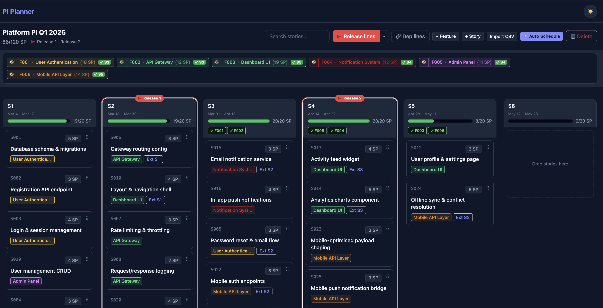

# PI Planning Tool

A self-contained planning board for SAFe teams. Plan your sprints, track dependencies, and manage capacity — all from your browser.



## Getting Started

Run with a single command:

```bash
docker run -d -p 4200:4200 -v pi_data:/var/lib/postgresql/data rolandsall24/pi-planning:latest
```

Open [http://localhost:4200](http://localhost:4200) in your browser.

The `-v pi_data:...` flag keeps your data safe across restarts. Omit it if you don't need persistence.

### Docker Compose

```bash
docker compose -f docker-compose.prod.yml up -d
```

See [`docker-compose.prod.yml`](docker-compose.prod.yml) for the full configuration.

## What You Can Do

### Create a PI

Start by creating a team and a Program Increment. Define your sprints — set capacity, dates, and optionally mark a release sprint. Use the "Auto-fill 2W" button to quickly set up consecutive two-week sprints.

### Plan on the Board

The board shows your sprints as columns with a backlog on the side. Each story is a card showing its title, points, and feature color.

- **Drag and drop** stories between sprints and the backlog
- **Click a story** to view details, edit it, or manage its dependencies
- **Feature legend** at the top lets you filter and navigate to feature detail pages

### Track Dependencies

Define which stories depend on other stories. The board draws visual dependency lines between cards so you can see the flow at a glance.

- **Dependency warnings** appear on cards when a story is scheduled before its dependency
- **External dependencies** let you mark stories that depend on work outside your team, specifying which sprint that work will be ready
- **Filter dependency lines** by feature or by individual story to reduce visual clutter

### Auto-Schedule

Hit the auto-schedule button to let the tool assign all backlog stories to sprints. It respects:

- Dependency order — stories are placed after their dependencies
- Sprint capacity — avoids overloading sprints
- External dependency timing — waits for external work to be ready

### Quick Fix

After manual changes, the Quick Fix button scans the board for problems and suggests corrections:

- Stories scheduled before their dependencies get moved to a valid sprint
- Overcommitted sprints get rebalanced by moving excess stories elsewhere

You can review each suggested move before applying it.

### Monitor Capacity

Each sprint column shows a capacity bar. When a sprint exceeds its capacity, you'll see a visual warning. The auto-scheduler and quick fix both factor capacity into their decisions.

### Track Releases

Mark a sprint as the release sprint. The board highlights it with a visual release line so the team can see what's in scope and what's not.

### Import from CSV

Bulk-import features and stories from a CSV file instead of creating them one by one. A blank template is available at [`sample-data/template.csv`](sample-data/template.csv).

| Column | Required | Description |
|--------|----------|-------------|
| `feature_id` | Yes | Feature identifier (e.g., `F001`) |
| `feature_name` | Yes | Feature display name |
| `story_id` | Yes | Story identifier (e.g., `S001`) |
| `story_title` | Yes | Story display name |
| `estimation` | Yes | Story point estimate (integer) |
| `depends_on` | No | Pipe-separated story IDs this story depends on (e.g., `S001\|S002`) |
| `external_dependency_sprint` | No | Sprint number of an external dependency (integer) |

Example:

```csv
feature_id,feature_name,story_id,story_title,estimation,depends_on,external_dependency_sprint
F001,User Authentication,S001,Database schema & migrations,5,,
F001,User Authentication,S002,Registration API endpoint,3,S001,
F001,User Authentication,S003,Login & session management,4,S001,
F001,User Authentication,S004,JWT middleware & token refresh,3,S002|S003,
```

A full sample dataset is available at [`sample-data/platform-team-pi-2026-q1.csv`](sample-data/platform-team-pi-2026-q1.csv).

### Dark Mode

The app supports dark and light themes. It follows your system preference by default, and you can toggle it manually from the nav bar.

## MediatorFlow (Optional Telemetry Dashboard)

MediatorFlow provides real-time telemetry, topology visualization, and execution tracing for the CQRS mediator pipeline. It's fully optional — the app works without it.

### Enable with Docker Compose

```bash
./docker-run.sh --mediatorflow
```

This starts the MediatorFlow dashboard alongside the main stack on [http://localhost:4800](http://localhost:4800). Without the flag, only the core services (db, api, web) start.

### Enable in Local Development

```bash
./dev.sh --with-mediatorflow
```

This runs a standalone MediatorFlow container and configures the API to send telemetry to it.

### Docker Compose with MediatorFlow

```yaml
services:
  pi-planning:
    image: rolandsall24/pi-planning:latest
    ports:
      - "4200:4200"
    environment:
      MEDIATOR_FLOW_ENABLED: "true"
      MEDIATOR_FLOW_URL: http://mediatorflow:4800
      EVENT_STORE_MODE: audit
    volumes:
      - pi_data:/var/lib/postgresql/data

  mediatorflow:
    image: rolandsall24/mediatorflow:latest
    ports:
      - "4800:4800"
    volumes:
      - mediatorflow_data:/var/lib/postgresql/data

volumes:
  pi_data:
  mediatorflow_data:
```

### Event Store Mode

The mediator pipeline stores domain events in PostgreSQL. You can switch between two modes:

- **`audit`** (default) — Events are logged for observability and tracing. The application state is driven by direct database writes as usual. Use this for standard operation.
- **`source`** — Full event sourcing. Application state is reconstructed from the event stream. Use this when you need complete audit history and the ability to replay events.

Switch modes by setting the `EVENT_STORE_MODE` environment variable:

```bash
# In .env
EVENT_STORE_MODE=source

# Or inline
EVENT_STORE_MODE=source ./dev.sh
```

### Environment Variables

| Variable | Values | Default | Description |
|----------|--------|---------|-------------|
| `EVENT_STORE_MODE` | `audit` \| `source` | `audit` | Event store strategy — `audit` logs events for tracing, `source` enables full event sourcing |
| `MEDIATOR_FLOW_ENABLED` | `true` \| `false` | `false` | Enable telemetry collection and forwarding to MediatorFlow |
| `MEDIATOR_FLOW_URL` | URL | `http://localhost:4800` | MediatorFlow collector endpoint |
| `MEDIATOR_FLOW_SERVICE_NAME` | string | `pi-planning` | Service name shown in the MediatorFlow dashboard |

All variables are optional and have sensible defaults. Set them in `.env` or pass them directly as environment variables.

## Local Development

```bash
# Install dependencies
npm install

# Copy environment config
cp .env.example .env

# Start everything (database, API, and UI with hot reload)
./dev.sh
```

The dev script handles starting PostgreSQL, running database migrations, seeding sample data, and launching the app on [http://localhost:4200](http://localhost:4200).
